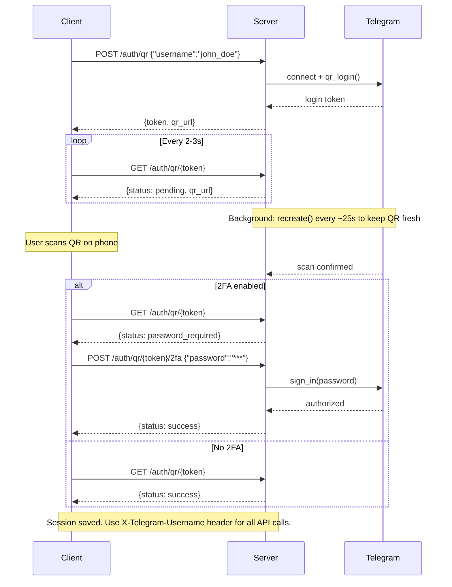

# Telegram Scraper API

FastAPI-based server for scraping and caching Telegram messages with streaming support.

## Features

- 🚀 **RESTful API** with FastAPI
- 📡 **Real-time streaming** via Server-Sent Events (SSE)
- 💾 **Smart caching** - downloads only missing data, serves cached content instantly
- 📦 **Chunked delivery** - configurable batch sizes for efficient data transfer
- 🔐 **Header-based authentication** - simple X-Telegram-Username header
- 🎯 **Media support** - download and serve media files with UUID-based access
- 📊 **SQLite caching** - persistent message and media storage with atomic commits
- ⚙️ **Runtime settings** - adjust download settings on the fly via API

## Quick Start

### Installation

```bash
# Install with Poetry
poetry install

# Or with pip
pip install -e .
```

### Docker

```bash
docker build -t telegram-scraper-server .

docker run -d -p 8000:8000 \
  -e TELEGRAM_API_ID=YOUR_API_ID \
  -e TELEGRAM_API_HASH=YOUR_API_HASH \
  -v ./data:/app/data \
  telegram-scraper-server
```

Sessions, cached data, and settings are stored in `/app/data` inside the container — mount it to persist across restarts.

### Prerequisites

Get Telegram API credentials:
1. Visit https://my.telegram.org/apps
2. Log in with your phone number
3. Create a new application
4. Note your `api_id` and `api_hash`

See [Obtain API id](https://core.telegram.org/api/obtaining_api_id) for more details.

### Setup

**1. Set up credentials:**

```bash
cp .env.example .env
```

Edit `.env`:

```bash
TELEGRAM_API_ID=YOUR_API_ID
TELEGRAM_API_HASH=YOUR_API_HASH
```

**2. Authenticate a user:**

**Option A: CLI (interactive)**

```bash
tgsc-auth john_doe
```

Follow the prompts to scan a QR code or enter your phone number.

**Option B: API (web-based QR login)**

Start the server first (step 3), then authenticate via API:

```bash
# Start a QR login session
curl -X POST http://localhost:8000/api/v3/auth/qr \
  -H "Content-Type: application/json" \
  -d '{"username": "john_doe"}'
# → {"token": "abc123...", "qr_url": "tg://login?token=...", ...}

# Poll for status (qr_url auto-refreshes every ~25s — re-render it each time)
curl http://localhost:8000/api/v3/auth/qr/{token}
# → {"status": "pending", "qr_url": "tg://login?token=FRESH...", ...}

# If 2FA is enabled (status == "password_required"):
curl -X POST http://localhost:8000/api/v3/auth/qr/{token}/2fa \
  -H "Content-Type: application/json" \
  -d '{"password": "your_2fa_password"}'
```

Render the `qr_url` as a QR code, then scan it in **Telegram → Settings → Devices → Link Desktop Device**.

Use `"force": true` in the POST body to re-authenticate an existing session.



**3. Start the server:**

```bash
tgsc-server
```

**4. Test the API:**

```bash
# Find channels
curl -H "X-Telegram-Username: john_doe" \
  "http://localhost:8000/api/v3/search/dialogs?q=telegram"

# Get message history
curl -H "X-Telegram-Username: john_doe" \
  "http://localhost:8000/api/v3/history/-1001234567890?start_date=2024-01-01&end_date=2024-01-31&chunk_size=250"

# Search messages across all chats
curl -H "X-Telegram-Username: john_doe" \
  "http://localhost:8000/api/v3/search/messages?q=hello"

# Download media
curl -H "X-Telegram-Username: john_doe" \
  "http://localhost:8000/api/v3/files/abc-123-uuid" -o photo.jpg
```

Visit `http://localhost:8000/docs` for interactive API documentation.

## Configuration

The configuration is retrieved from three distinct sources:
- environment variables;
- CLI parameters;
- yaml file with server settings;

| What | Source | How to change |
|------|--------|---------------|
| `api_id`, `api_hash` | `.env` / environment variables | Edit `.env`, restart |
| `data_dir` | CLI `--data-dir` | `tgsc-server --data-dir ./my-data` |
| `host`, `port` | CLI `--host` / `--port` | `tgsc-server --port 9000` |
| `download_media`, `max_media_size_mb`, `telegram_batch_size`, `repair_media`, `download_file_types` | `settings.yaml` in data dir | API or edit file |

### Data Directory Layout

```
data/                     ← --data-dir (default ./data)
├── sessions/             ← Telegram session files
├── channels/             ← Per-channel SQLite databases + media
│   ├── -1001234567890/
│   │   ├── -1001234567890.db
│   │   └── media/
│   └── ...
└── settings.yaml         ← Runtime settings (auto-created on first run)
```

### Runtime Settings

Settings are stored in `{data_dir}/settings.yaml` and can be changed at runtime via the API:

```bash
# Get current settings
curl -H "X-Telegram-Username: john_doe" \
  http://localhost:8000/api/v3/settings

# Update settings
curl -X PATCH http://localhost:8000/api/v3/settings \
  -H "X-Telegram-Username: john_doe" \
  -H "Content-Type: application/json" \
  -d '{"download_media": false, "max_media_size_mb": 50}'
```

Changes take effect immediately and are saved to `settings.yaml`.

You can also import a settings file on startup:

```bash
# Import a settings template (overwrites existing settings.yaml in data dir)
tgsc-server --settings ./my-settings.yaml
```

### CLI Reference

```bash
# Server
tgsc-server --help
tgsc-server                                    # defaults: ./data, 0.0.0.0:8000
tgsc-server --data-dir ./project --port 9000   # custom data dir and port
tgsc-server --settings ./template.yaml         # import settings template

# Authentication
tgsc-auth --help
tgsc-auth john_doe                             # authenticate with default data dir
tgsc-auth john_doe --data-dir ./project        # custom data dir
```

## API Endpoints

### 1. Search Dialogs

```http
GET /api/v3/search/dialogs?q={query}
Header: X-Telegram-Username: your_username
```

Search for channels, groups, and users. Use the `q` query parameter for the search term (e.g. `?q=telegram`).

### 2. Message History

```http
GET /api/v3/history/{channel_id}?start_date={date}&end_date={date}&chunk_size={size}
Header: X-Telegram-Username: your_username
```

Stream message history with smart caching:
- `chunk_size=250` - Stream in chunks (Server-Sent Events)
- `force_refresh=true` - Bypass cache and re-download
- `reverse=true` (default) - Oldest-first; `reverse=false` - Newest-first

### 3. Search Messages

```http
GET /api/v3/search/messages?q={query}
GET /api/v3/search/messages/{dialog_id}?q={query}
Header: X-Telegram-Username: your_username
```

Search for messages containing specific words or phrases. Use the `q` query parameter for the search term. Searches Telegram directly — no pre-caching required.
- Global search: omit `dialog_id` to search across all chats (`messages.searchGlobal`)
- Per-dialog search: include `dialog_id` to search within a specific chat (`messages.search`)
- Optional filters: `start_date`, `end_date`, `from_user` (per-dialog only), `limit`

### 4. Media Files

```http
GET /api/v3/files/{uuid}
Header: X-Telegram-Username: your_username
```

Download media file by UUID (provided in message response).

### 5. Settings

```http
GET /api/v3/settings
PATCH /api/v3/settings
Header: X-Telegram-Username: your_username
```

Read and update runtime settings. Defaults: `download_media` true, `max_media_size_mb` 20, `telegram_batch_size` 100, `repair_media` true, `download_file_types` (photos, videos, voice_messages, video_messages, stickers, gifs, files) all true.

## Documentation

**[Interactive API Docs](http://localhost:8000/docs)** - Swagger UI (when server is running)

## Development

### Check linting

```bash
ruff check src/
```

## Troubleshooting

### "User not authenticated"

Authenticate first:

```bash
tgsc-auth your_username
```

### "Missing X-Telegram-Username header"

All API requests require this header:

```bash
curl -H "X-Telegram-Username: your_username" ...
```

### "Missing Telegram API credentials"

Set credentials in `.env`:

```bash
cp .env.example .env
# Edit .env with your api_id and api_hash
```

### Port already in use

```bash
tgsc-server --port 9000
```

## License

[MIT License](LICENSE)

## Acknowledgement

Built based on: https://github.com/unnohwn/telegram-scraper
