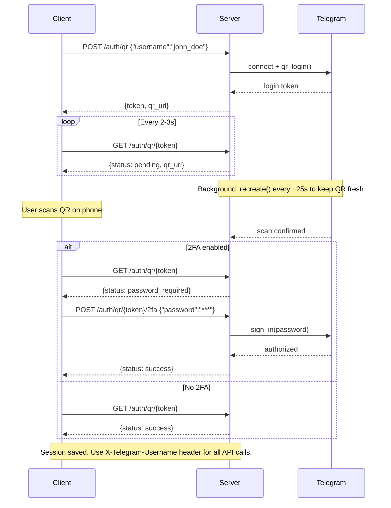

# Telegram Scraper API

FastAPI-based server for scraping and caching Telegram messages with streaming support.

## Features

- 🚀 **RESTful API** with FastAPI
- 📡 **Real-time streaming** via Server-Sent Events (SSE)
- 💾 **Smart caching** - downloads only missing data, serves cached content instantly
- 📦 **Chunked delivery** - configurable batch sizes for efficient data transfer
- 🔐 **Header-based authentication** - simple X-Telegram-Username header
- 🎯 **Media support** - download and serve media files with UUID-based access
- 📊 **SQLite caching** - persistent message and media storage with atomic commits
- ⚙️ **Flexible configuration** - YAML, environment variables, or CLI parameters

## Quick Start

### Installation

```bash
# Install with Poetry
poetry install

# Or with pip
pip install -e .
```

### Docker

```bash
docker build -t telegram-scraper-server .

docker run -d -p 8000:8000 \
  -e TELEGRAM_API_ID=YOUR_API_ID \
  -e TELEGRAM_API_HASH=YOUR_API_HASH \
  -v ./data:/app/data \
  telegram-scraper-server
```

Sessions and cached data are stored in `/app/data` inside the container — mount it to persist across restarts.

You can also mount a config file instead of using env vars:

```bash
docker run -d -p 8000:8000 \
  -v ./config.yaml:/app/config.yaml:ro \
  -v ./data:/app/data \
  telegram-scraper-server --config /app/config.yaml
```

### Prerequisites

Get Telegram API credentials:
1. Visit https://my.telegram.org/apps
2. Log in with your phone number
3. Create a new application
4. Note your `api_id` and `api_hash`

See [Obtain API id](https://core.telegram.org/api/obtaining_api_id) for more details.

### Setup

**1. Create configuration file:**

```bash
cp config.example.yaml config.yaml
```

Edit `config.yaml`:

```yaml
api_id: "YOUR_API_ID"
api_hash: "YOUR_API_HASH"
download_media: true
max_media_size_mb: 50
output_path: "./output"
sessions_path: "./sessions"
host: "0.0.0.0"
port: 8000
```

**2. Authenticate a user:**

**Option A: CLI (interactive)**

```bash
tgsc-auth john_doe --config config.yaml
```

Follow the prompts to scan a QR code or enter your phone number.

**Option B: API (web-based QR login)**

Start the server first (step 3), then authenticate via API:

```bash
# Start a QR login session
curl -X POST http://localhost:8000/api/v2/auth/qr \
  -H "Content-Type: application/json" \
  -d '{"username": "john_doe"}'
# → {"token": "abc123...", "qr_url": "tg://login?token=...", ...}

# Poll for status (qr_url auto-refreshes every ~25s — re-render it each time)
curl http://localhost:8000/api/v2/auth/qr/{token}
# → {"status": "pending", "qr_url": "tg://login?token=FRESH...", ...}

# If 2FA is enabled (status == "password_required"):
curl -X POST http://localhost:8000/api/v2/auth/qr/{token}/2fa \
  -H "Content-Type: application/json" \
  -d '{"password": "your_2fa_password"}'
```

Render the `qr_url` as a QR code, then scan it in **Telegram → Settings → Devices → Link Desktop Device**.

Use `"force": true` in the POST body to re-authenticate an existing session.



**3. Start the server:**

```bash
tgsc-server --config config.yaml
```

**4. Test the API:**

```bash
# Find channels
curl -H "X-Telegram-Username: john_doe" \
  "http://localhost:8000/api/v1/find-channels?search_by=username&query=telegram"

# Get message history
curl -H "X-Telegram-Username: john_doe" \
  "http://localhost:8000/api/v1/history/-1001234567890?start_date=2024-01-01&end_date=2024-01-31&chunk_size=250"

# Download media
curl -H "X-Telegram-Username: john_doe" \
  "http://localhost:8000/api/v1/files/abc-123-uuid" -o photo.jpg"
```

Visit `http://localhost:8000/docs` for interactive API documentation.

## API Endpoints

### 1. Find Channels

```http
GET /api/v1/find-channels?search_by={criteria}&query={query}
Header: X-Telegram-Username: your_username
```

Search for channels by username, ID, or title.

### 2. Message History

```http
GET /api/v1/history/{channel_id}?start_date={date}&end_date={date}&chunk_size={size}
Header: X-Telegram-Username: your_username
```

Stream message history with smart caching:
- `chunk_size=250` - Stream in chunks (Server-Sent Events)
- `chunk_size=0` - Return all messages at once
- `force_refresh=true` - Bypass cache and re-download

### 3. Media Files

```http
GET /api/v1/files/{uuid}
Header: X-Telegram-Username: your_username
```

Download media file by UUID (provided in message response).

## Configuration

### Priority Order

Parameters are resolved in the following priority (highest to lowest):

1. **CLI arguments** (if explicitly provided)
2. **Environment variables**
3. **Config file values** (if `--config` specified)
4. **Defaults**

### YAML Config File

```yaml
api_id: "YOUR_API_ID"
api_hash: "YOUR_API_HASH"
download_media: true
max_media_size_mb: 50
telegram_batch_size: 100
output_path: "./output"
sessions_path: "./sessions"
host: "0.0.0.0"
port: 8000
```

### Environment Variables

```bash
export TELEGRAM_API_ID="YOUR_API_ID"
export TELEGRAM_API_HASH="YOUR_API_HASH"
export DOWNLOAD_MEDIA=true
export MAX_MEDIA_SIZE_MB=50
```

### CLI Parameters

```bash
# View all available parameters
tgsc-server --help

# With config file
tgsc-server --config config.yaml

# Override specific parameters
tgsc-server --config config.yaml --port 9000 --no-download-media

# Without config file (uses defaults)
tgsc-server --api-id YOUR_ID --api-hash YOUR_HASH
```

## Documentation

**[Interactive API Docs](http://localhost:8000/docs)** - Swagger UI (when server is running)

## Development

### Run in development mode

```bash
uvicorn telegram_scraper.server:app --reload --host 0.0.0.0 --port 8000
```

> **Note:** When using `uvicorn` directly, the server will use environment variables instead of `config.yaml`. Set `TELEGRAM_API_ID`, `TELEGRAM_API_HASH`, etc. as environment variables, or use `tgsc-server --config config.yaml` to load from the config file.

### Check linting

```bash
ruff check src/
```

## Troubleshooting

### "User not authenticated"

Authenticate first:

```bash
tgsc-auth your_username --config config.yaml
```

### "Missing X-Telegram-Username header"

All API requests require this header:

```bash
curl -H "X-Telegram-Username: your_username" ...
```

### Port already in use

```bash
tgsc-server --port 9000
```

## License

[Your License Here]

## Acknowledgement

Built based on: https://github.com/unnohwn/telegram-scraper
